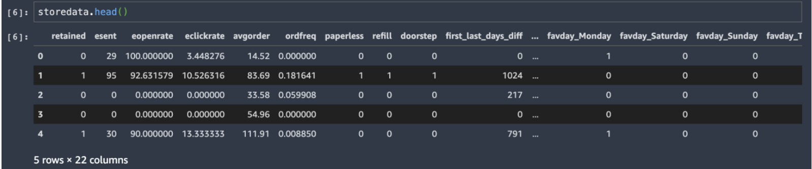
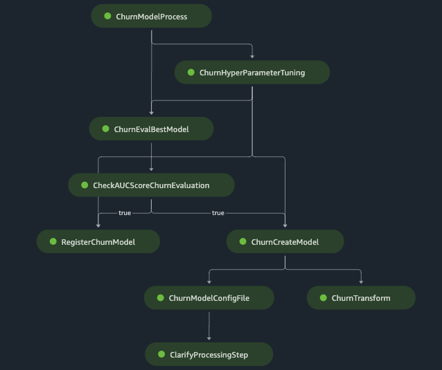

# Customer-Churn-SageMaker
Build, tune, and deploy an end-to-end churn prediction model using Amazon SageMaker Pipelines.

The ability to predict that a particular customer is at a high risk of churning, while there is still time to do something about it, represents a huge additional potential revenue source for every online business. Depending on the industry and business objective, the problem statement can be multi-layered. 

This post discusses how you can orchestrate an end-to-end churn prediction model across each step: data preparation, experimenting with a baseline model and hyperparameter optimization (HPO), training and tuning, and registering the best model. You can manage your Amazon SageMaker training and inference workflows using Amazon SageMaker Studio and the SageMaker Python SDK. SageMaker offers all the tools you need to create high-quality data science solutions.

## Description
Customer Churn Model to predict if a customer would be retained or not.
1. Store Retail Dataset (https://www.kaggle.com/uttamp/store-data)
2. Binary Classification Model using the SageMaker XGBoost Framework

## DataSet

## Run Code:
1. Download and save the Store Retail Dataset (https://www.kaggle.com/uttamp/store-data) in the default Amazon Simple Storage Service (Amazon S3) bucket associated with your SageMaker session or in the S3 bucket of your choice. Also, create a folder "data" within the repo and save the dataset in this folder.
2. The Customer_Churn_Modeling.ipynb can be used to run through each step of the model development in an interactive way.
3. SageMaker_Pipelines_Project.ipynb is to launch the SM Pipeline which would orchestrate each step of the model from preprocessing through creating model, running predictions etc..

## SageMaker Pipeline Workflow for Churn Model

## Steps
1. ChurnModelProcess (SageMaker Processing Step)-  Preprocess data to build the features required and split data in train/validation/test datasets.
2. ChurnHyperParameterTuning (SageMaker Tuning Step) - Applies HyperParameterTuning based on the ranges provided with the SageMaker XGBoost Framework to give the best model which is determined based on AUC Score.
3. ChurnEvalBestModel (SageMaker Processing Step)- Evaluates the best model using the test dataset.
4. CheckAUCScoreChurnEvaluation (SageMaker Condition Step)- Check if the AUC Score is above a certain threshold.If true, run through the below steps.
5. RegisterChurnModel (SageMaker Register Model Step)- Register the trained churn model onto SageMaker Model Registry.
6. ChurnCreateModel (SageMaker Create Model Step)- Creates SageMaker Model by taking the artifacts of the best model
7. ChurnTransform (SageMaker Transform Step)- Applies Batch Transform on the given dataset by using the model created in the previous step
8. ChurnModelConfigFile (SageMaker Processing Step)- Creates the config file which includes information as to which columns to check bias on, baseline values for generating SHAPley plots etc..
9. ClarifyProcessing Step (SageMaker Processing Step)- Applies SageMaker Clarify using the config file created in the previous step to generate Model Explainability, Bias Information reports.

## Security
See CONTRIBUTING for more information.

## License
This library is licensed under the MIT-0 License. See the LICENSE file.
